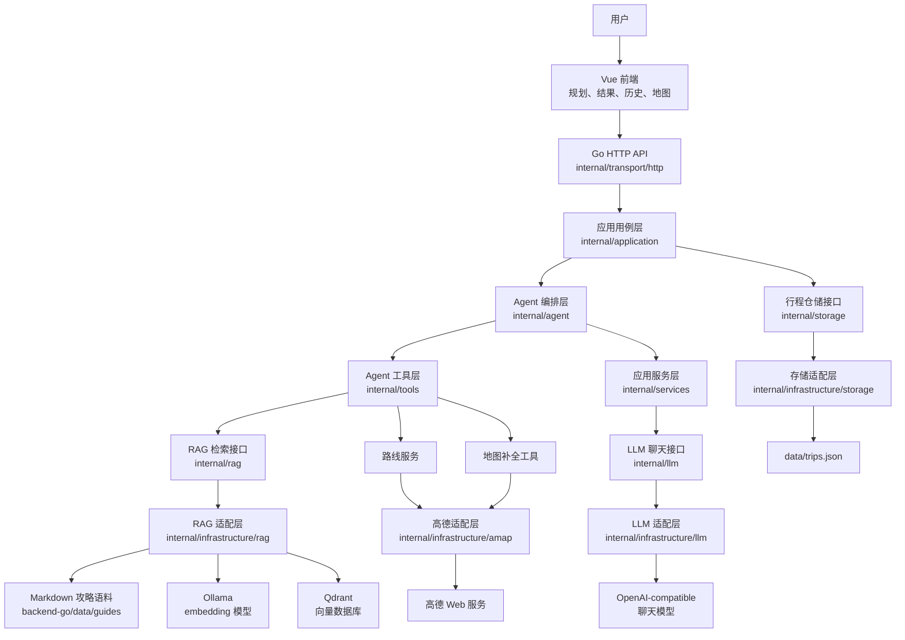

# 旅行助手 Agent

旅行助手 Agent 是一个面向中文旅行场景的 AI 行程规划项目。用户填写目的地、日期、预算、人数、偏好和备注后，系统会生成结构化 itinerary，并支持地图点位展示、天气提示、路线补全、智能编辑、历史保存和 Markdown 导出。

项目当前由 Go 后端和 Vue 前端组成。后端已经接入可选的 tool-calling Agent、Qdrant 向量检索、Ollama embedding、高德地图/天气/路线适配，以及 JSON 文件存储。新增的高级 RAG 支持 Markdown 词法检索、Qdrant dense 检索、hybrid 融合检索、可选 HTTP reranker、自动化评测和多配置对比。没有模型或外部 API 配置时，系统会回落到规则规划器、本地 Markdown 检索和示例天气，保证基础流程可以跑通。

## 项目框架图



## 技术栈

- 后端：Go 1.22，标准库 HTTP 服务，采用“整洁架构 / 端口与适配器”分层。
- 前端：Vue 3，TypeScript，Vite，Ant Design Vue，Axios，高德 JavaScript API。
- Agent：固定步骤 Agent + 可选 OpenAI-compatible tool-calling Agent + Go 原生链式 multi-agent 编排。
- RAG：本地 Markdown 检索兜底；可切换到 Ollama embedding + Qdrant 向量检索，或使用 hybrid 模式融合 dense + lexical + RRF + 可选 reranker。
- LLM：通过 `internal/llm` 抽象聊天模型，当前实现是 OpenAI-compatible HTTP 客户端。
- 外部 API：高德地图补全、天气、路线规划适配层。
- 存储：通过 `internal/storage` 抽象仓储，当前实现是 JSON 文件。

## 目录结构

```text
Travel-Agent/
├── backend-go/                  # Go 后端
│   ├── cmd/server/              # HTTP 服务入口
│   ├── cmd/index-rag/           # Markdown 攻略同步到 Qdrant 的索引任务
│   ├── data/guides/             # 本地 Markdown 攻略语料
│   ├── internal/                # 后端业务代码
│   └── README.md                # 后端开发说明
├── frontend/                    # Vue 前端
│   ├── src/
│   └── README.md                # 前端开发说明
├── docs/                        # 架构与后续优化文档
│   ├── go-learning-manual.md     # Go 后端学习手册
│   ├── advanced-rag.md           # 高级 RAG 搭建、评测和重排说明
│   └── backend-architecture.md   # 后端架构说明
├── assets/showcase/             # README 展示截图
└── README.md
```

## 学习手册

如果你想快速掌握这个项目的 Go 后端设计，建议从 [`docs/go-learning-manual.md`](docs/go-learning-manual.md) 开始。手册按“先跑通、再读懂、最后能改”的顺序讲解：

- Go 项目的函数、结构体、接口和依赖注入如何设计。
- HTTP、Application、Agent、Tools、Services、Infrastructure 各层如何协作。
- 新增高级 RAG、HTTP reranker、`eval-rag`、`compare-rag` 应该怎么理解和调试。
- 新增功能时应该放在哪个目录、改哪些文件、跑哪些验证命令。

## 后端接口

| 方法 | 路径 | 说明 |
| --- | --- | --- |
| `GET` | `/health` | 健康检查 |
| `POST` | `/trip/generate` | 生成行程 |
| `POST` | `/trip/edit` | 根据自然语言编辑行程 |
| `POST` | `/trip/save` | 保存行程 |
| `GET` | `/trip` | 查看历史行程列表 |
| `GET` | `/trip/{trip_id}` | 查看行程详情 |
| `DELETE` | `/trip/{trip_id}` | 删除行程 |
| `GET` | `/weather/forecast?city=大理` | 获取天气预报，未启用高德时返回示例数据 |
| `GET` | `/export/{trip_id}/markdown` | 导出 Markdown |

当前后端只实现 Markdown 导出，尚未实现 PDF 导出。

## 快速启动

启动后端：

```powershell
cd F:\Code\Travel-Agent\backend-go
go run ./cmd/server
```

默认端口是 `8000`。启动后访问：

```text
http://127.0.0.1:8000/health
```

启动前端：

```powershell
cd F:\Code\Travel-Agent\frontend
npm install
npm run dev
```

浏览器访问：

```text
http://127.0.0.1:5173
```

## RAG 检索

如果只想跑通项目，可以保持默认 `RAG_BACKEND=markdown`，后端会直接读取 `backend-go/data/guides` 下的攻略 Markdown。

如果要启用 Qdrant + Ollama：

```env
RAG_BACKEND=qdrant
QDRANT_URL=http://127.0.0.1:6333
QDRANT_COLLECTION=travel_guides
EMBEDDING_BASE_URL=http://127.0.0.1:11434
EMBEDDING_MODEL=bge-m3
EMBEDDING_DIM=1024
DATA_DIR=data/guides
```

索引 Markdown 攻略到 Qdrant：

```powershell
cd F:\Code\Travel-Agent\backend-go
go run ./cmd/index-rag
```

如果要启用高级 hybrid 检索：

```env
RAG_BACKEND=hybrid
RAG_CANDIDATE_K=40
RAG_RRF_K=60
RAG_QUERY_VARIANTS=3
RAG_MAX_CONTEXT_CHARS=6000
```

可选启用 HTTP reranker：

```env
RAG_RERANKER_URL=http://127.0.0.1:9001/rerank
RAG_RERANKER_MODEL=bge-reranker-v2-m3
RAG_RERANKER_TIMEOUT_SECONDS=30
```

运行 RAG 评测：

```powershell
cd F:\Code\Travel-Agent\backend-go
go run ./cmd/eval-rag --backend markdown --cases data\eval\rag_cases.jsonl --top-k 5
go run ./cmd/eval-rag --backend hybrid --cases data\eval\rag_cases.jsonl --top-k 5
```

更多高级 RAG、重排和评测说明见 [`docs/advanced-rag.md`](docs/advanced-rag.md)。

## 配置

后端读取 `backend-go/.env` 或环境变量。常用配置如下：

```env
PORT=8000
DATA_DIR=data/guides
STORAGE_FILE=data/trips.json
AGENT_MODE=tool

LLM_API_KEY=
LLM_BASE_URL=https://dashscope.aliyuncs.com/compatible-mode/v1
LLM_MODEL=qwen-max
LLM_TIMEOUT_SECONDS=60

RAG_BACKEND=markdown
RAG_CANDIDATE_K=40
RAG_RRF_K=60
RAG_QUERY_VARIANTS=3
RAG_MAX_CONTEXT_CHARS=6000
RAG_RERANKER_URL=
RAG_RERANKER_MODEL=bge-reranker-v2-m3
RAG_RERANKER_TIMEOUT_SECONDS=30
QDRANT_URL=http://127.0.0.1:6333
QDRANT_COLLECTION=travel_guides
EMBEDDING_BASE_URL=http://127.0.0.1:11434
EMBEDDING_MODEL=bge-m3
EMBEDDING_DIM=1024

ENABLE_AMAP_ENRICHMENT=false
ENABLE_AMAP_WEATHER=false
ENABLE_AMAP_ROUTING=false
AMAP_API_KEY=
AMAP_BASE_URL=https://restapi.amap.com/v3
AMAP_BASE_V5_URL=https://restapi.amap.com/v5

ENABLE_WEB_RESEARCH=false
WEB_SEARCH_ENDPOINT=
WEB_SEARCH_API_KEY=
WEB_RESEARCH_TIMEOUT_SECONDS=20
WEB_RESEARCH_MAX_PAGES=3
```

前端读取 `frontend/.env`：

```env
VITE_API_BASE_URL=http://127.0.0.1:8000
VITE_AMAP_JS_KEY=你的高德 JavaScript API Key
```

## 验证

后端测试：

```powershell
cd F:\Code\Travel-Agent\backend-go
go test ./...
```

前端构建：

```powershell
cd F:\Code\Travel-Agent\frontend
npm run build
```

Vite 可能提示主 chunk 大于 500 kB，这是依赖体积警告，不影响运行。

## 当前限制

- PDF 导出未实现，只支持 Markdown。
- JSON 文件存储适合原型和本地开发，不适合生产级高并发写入。
- 高德地图、天气、路线依赖有效 Key；配置关闭或调用失败时会保留兜底行为。
- Qdrant 向量检索需要先运行索引任务，否则无法检索到攻略片段。
