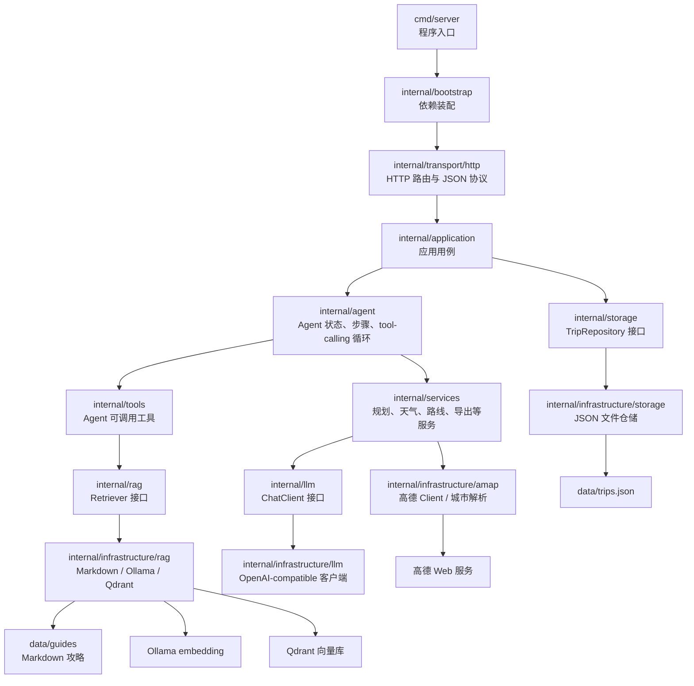
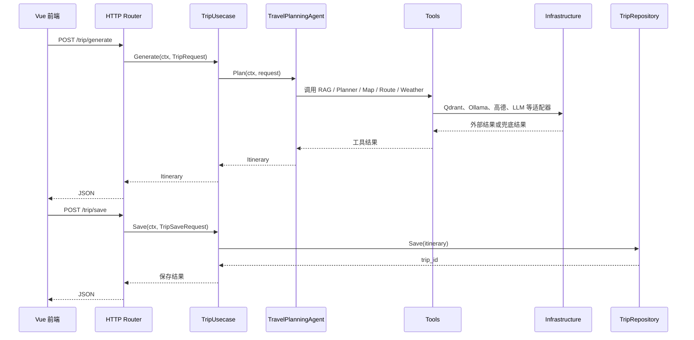

# Go 后端开发说明

`backend-go/` 是旅行助手 Agent 的后端实现。它负责 HTTP 接口、Agent 编排、行程生成与编辑、RAG 检索、天气与路线补全、地图点位补全、历史存储和 Markdown 导出。

后端当前采用轻量“整洁架构 / 端口与适配器”架构：业务层依赖接口，外部系统实现放在 `internal/infrastructure`，最后由 `internal/bootstrap` 统一装配。这样后续要把 JSON 换成 MySQL、把 Qdrant 换成其他向量库、把模型供应商换掉，都不需要大改 Agent 主流程。

## 后端框架图



## 目录职责

```text
backend-go/
├── cmd/server/                     # HTTP 服务入口，只负责启动
├── cmd/index-rag/                  # 文档同步任务：Markdown -> Ollama embedding -> Qdrant
├── data/guides/                    # 本地攻略 Markdown，既可兜底检索，也可同步到 Qdrant
├── internal/bootstrap/             # 应用装配和依赖注入，根据配置选择具体实现
├── internal/config/                # 环境变量和 .env 读取
├── internal/domain/                # 请求、响应、行程等核心数据模型
├── internal/transport/http/        # HTTP 路由、JSON 编解码、状态码、CORS
├── internal/application/           # 用例层，连接 HTTP、Agent、仓储
├── internal/agent/                 # Agent 工作流、状态、步骤、tool-calling 循环、multi-agent 编排
├── internal/tools/                 # Agent 工具包装，负责把服务能力暴露给模型调用
├── internal/services/              # 应用服务：规划、天气、路线、编辑、导出、在线研究
├── internal/rag/                   # RAG 抽象接口，只定义 port，不写 Qdrant 细节
├── internal/llm/                   # LLM 抽象接口，只定义聊天和 tool-call DTO
├── internal/storage/               # 仓储抽象接口，只定义 TripRepository
├── internal/infrastructure/        # 外部系统适配层
│   ├── amap/                       # 高德 Web 服务 Client 和城市解析
│   ├── llm/                        # OpenAI-compatible HTTP 实现
│   ├── rag/                        # Markdown、Ollama、Qdrant 的具体实现
│   └── storage/                    # JSON 文件仓储实现
├── internal/validators/            # 预算、节奏、偏好、路线校验
└── internal/logging/               # 结构化日志和 request id
```

## 核心接口

| 方法 | 路径 | 说明 |
| --- | --- | --- |
| `GET` | `/health` | 健康检查 |
| `POST` | `/trip/generate` | 生成行程 |
| `POST` | `/trip/edit` | 编辑行程 |
| `POST` | `/trip/save` | 保存行程 |
| `GET` | `/trip` | 查看历史列表 |
| `GET` | `/trip/{trip_id}` | 查看详情 |
| `DELETE` | `/trip/{trip_id}` | 删除行程 |
| `GET` | `/weather/forecast?city=大理` | 获取天气，未启用高德时返回示例数据 |
| `GET` | `/export/{trip_id}/markdown` | 导出 Markdown |

当前后端没有实现 PDF 导出。

## 请求主流程



## RAG 设计

核心包 `internal/rag` 只定义接口：

```go
type Retriever interface {
    Retrieve(destination string, preferences []string, pace string, specialNotes string, topK int) ([]string, error)
}
```

具体实现放在 `internal/infrastructure/rag`：

```text
markdown_retriever.go  # 本地 Markdown 兜底检索
embedding_client.go    # Ollama embedding 适配器
qdrant_client.go       # Qdrant REST 适配器
qdrant_retriever.go    # Qdrant 向量检索实现
```

切换方式在 `internal/bootstrap/app.go` 中完成：

- `RAG_BACKEND=markdown`：使用本地 Markdown 检索。
- `RAG_BACKEND=qdrant`：使用 Ollama 生成查询向量，再到 Qdrant 搜索攻略片段。

同步攻略到 Qdrant：

```powershell
cd F:\Code\Travel-Agent\backend-go
go run ./cmd/index-rag
```

## LLM 客户端设计

核心包 `internal/llm` 定义 `ChatClient`、`ChatRequest`、`ChatMessage`、`ToolDefinition` 等模型无关结构。当前实现是 `internal/infrastructure/llm/openai_compatible.go`。

Agent 和 Planner 只依赖 `llm.ChatClient`，不直接依赖某一家模型供应商。以后如果要接入 Ollama Chat、DeepSeek、通义千问或本地 vLLM，优先新增一个 infrastructure 实现，再在 bootstrap 中选择。

## 存储设计

核心包 `internal/storage` 定义 `TripRepository`。当前 JSON 文件实现放在 `internal/infrastructure/storage/json_repository.go`。

这种写法的好处是：

- `application` 不关心数据到底存到哪里。
- JSON 文件可以继续服务本地 demo。
- 以后迁移 SQLite、MySQL、PostgreSQL 或 Redis 时，只需要新增仓储实现并在 bootstrap 装配。

## 高德适配层

高德相关 HTTP 访问集中在 `internal/infrastructure/amap`：

```text
client.go         # 统一的高德 Web 服务 Client
city_resolver.go  # 城市名 -> adcode / 经纬度
```

天气、地图补全和路线规划共用同一个高德 Client，避免每个服务各自拼 URL、各自处理 Key 和超时。

## 配置

后端读取 `backend-go/.env`，也可以直接用环境变量覆盖。常用配置如下：

```env
PORT=8000
DATA_DIR=data/guides
STORAGE_FILE=data/trips.json
AGENT_MODE=tool

LLM_API_KEY=
LLM_BASE_URL=https://dashscope.aliyuncs.com/compatible-mode/v1
LLM_MODEL=qwen-max
LLM_TIMEOUT_SECONDS=60

RAG_BACKEND=markdown
QDRANT_URL=http://127.0.0.1:6333
QDRANT_COLLECTION=travel_guides
EMBEDDING_BASE_URL=http://127.0.0.1:11434
EMBEDDING_MODEL=bge-m3
EMBEDDING_DIM=1024

ENABLE_AMAP_ENRICHMENT=false
ENABLE_AMAP_WEATHER=false
ENABLE_AMAP_ROUTING=false
AMAP_API_KEY=
AMAP_BASE_URL=https://restapi.amap.com/v3
AMAP_BASE_V5_URL=https://restapi.amap.com/v5

ENABLE_WEB_RESEARCH=false
WEB_SEARCH_ENDPOINT=
WEB_SEARCH_API_KEY=
WEB_RESEARCH_TIMEOUT_SECONDS=20
WEB_RESEARCH_MAX_PAGES=3
```

## 启动方式

```powershell
cd F:\Code\Travel-Agent\backend-go
go run ./cmd/server
```

默认端口是 `8000`。启动后访问：

```text
http://127.0.0.1:8000/health
```

## 测试

```powershell
cd F:\Code\Travel-Agent\backend-go
go test ./...
```

## 开发规则

- 新外部系统优先放到 `internal/infrastructure/<area>`。
- 上层业务需要依赖外部能力时，先在核心包里定义小接口，再由 infrastructure 实现。
- `domain` 只放核心数据结构，不导入基础设施实现。
- `agent` 和 `tools` 不直接拼外部 HTTP 请求。
- `bootstrap` 是允许集中引用各层实现的装配位置。
