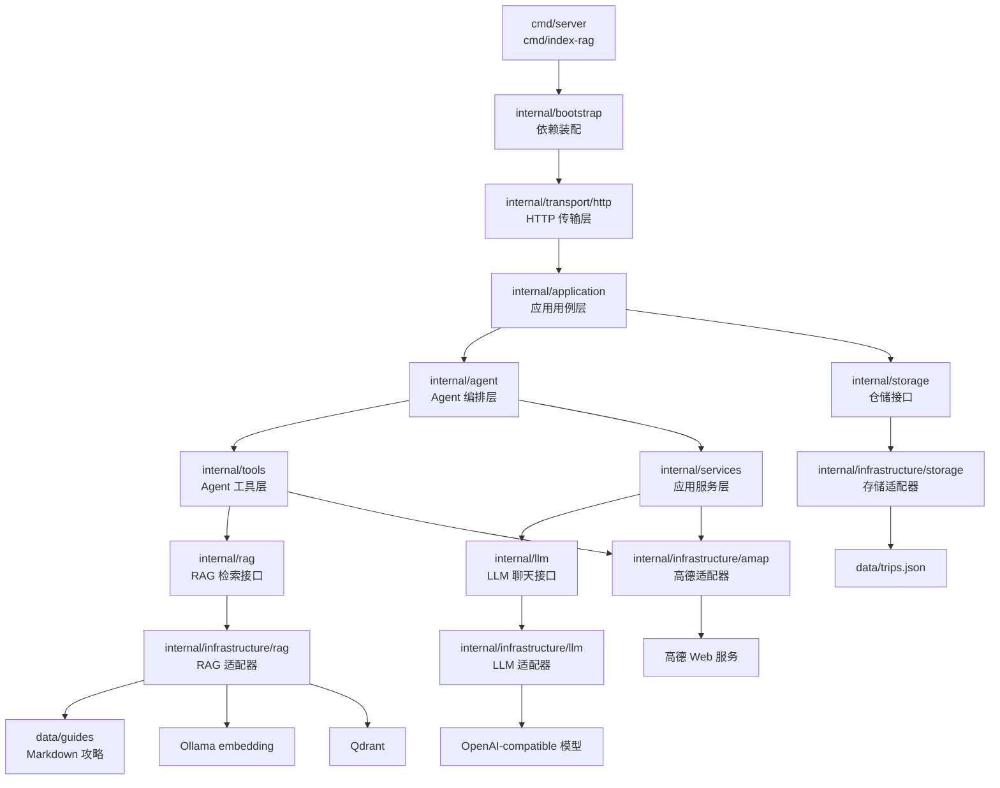
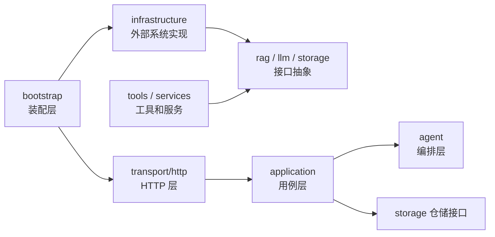
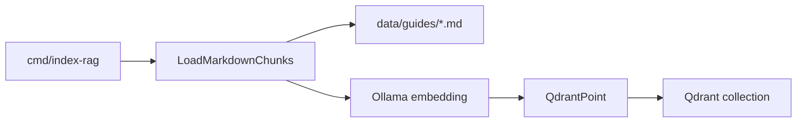
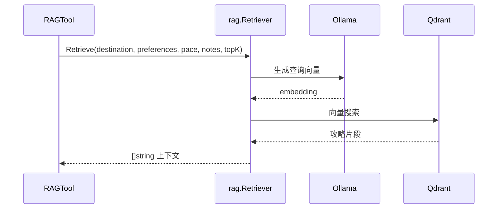

# Go 后端架构说明

本文档说明 `backend-go/` 当前的后端分层方式、依赖方向和新增功能时的落位规则。项目采用轻量“整洁架构 / 端口与适配器”架构，核心目标是让 Agent 流程保持稳定，同时把存储、LLM、RAG、高德等外部能力拆成可替换的适配层。

## 总体架构图



## 分层边界

```text
cmd/
  程序入口。只负责读取配置、初始化日志、启动 HTTP 服务或执行命令行任务。

internal/config/
  配置读取。启动时从 .env 和环境变量读取配置，之后通过 Config 注入各层。

internal/domain/
  领域数据结构。放请求、响应、行程、天气、路线等核心模型。

internal/transport/http/
  传输层。只处理 HTTP 路由、JSON、状态码、CORS、请求日志，不写业务规则。

internal/application/
  应用用例层。负责把 HTTP 请求转换成业务动作，协调 Agent、服务和仓储。

internal/agent/
  Agent 编排层。负责固定步骤 Agent、tool-calling Agent、Agent 状态和工具调用循环。

internal/tools/
  Agent 工具层。把 RAG、规划、地图、路线、在线研究等能力包装成 Agent 可调用工具。

internal/services/
  应用服务层。放规划、天气、路线、行程编辑、导出、在线攻略研究等服务逻辑。

internal/rag/
  RAG 检索接口。只定义检索接口和通用数据结构，不导入 Qdrant、Ollama 或文件系统实现。

internal/llm/
  LLM 聊天接口。只定义聊天模型接口和 tool-call DTO，不绑定具体模型供应商。

internal/storage/
  仓储接口。只定义 TripRepository，不关心底层存储介质。

internal/infrastructure/
  外部系统适配层。放 Qdrant、Ollama、OpenAI-compatible、高德、JSON 文件等具体实现。

internal/bootstrap/
  依赖装配层。根据配置选择具体 adapter，把接口和实现连接起来。
```

## 依赖方向

核心规则是：业务层依赖抽象，基础设施实现抽象。



开发时尽量保持以下约束：

- `domain` 不导入 `infrastructure`。
- `agent` 不直接请求 Qdrant、Ollama、高德或数据库。
- `tools` 可以依赖服务或 port，但不应该各自重复实现外部 HTTP Client。
- `application` 依赖 `storage.TripRepository`，不依赖 JSON 文件实现。
- `bootstrap` 是集中引用具体实现的地方。

## RAG 架构

RAG 的核心接口在 `internal/rag/retriever.go`：

```go
type Retriever interface {
    Retrieve(destination string, preferences []string, pace string, specialNotes string, topK int) ([]string, error)
}
```

实现放在 `internal/infrastructure/rag`：

```text
markdown_retriever.go  # 本地 Markdown 检索兜底
embedding_client.go    # Ollama /api/embed 适配器
qdrant_client.go       # Qdrant REST 适配器
qdrant_retriever.go    # 向量检索实现
```

索引流程：



查询流程：



切换规则在 `internal/bootstrap/app.go`：

- `RAG_BACKEND=markdown`：使用 `NewMarkdownRetriever`。
- `RAG_BACKEND=qdrant`：使用 `NewQdrantRetriever`。

## LLM 客户端架构

LLM 抽象在 `internal/llm/chat.go`：

```go
type ChatClient interface {
    Chat(ctx context.Context, request ChatRequest) (ChatMessage, error)
}
```

当前实现：

```text
internal/infrastructure/llm/openai_compatible.go
```

Agent 和 LLMPlanner 只依赖 `llm.ChatClient`。如果后续新增本地 Ollama Chat、DeepSeek、通义千问或 vLLM，建议新增：

```text
internal/infrastructure/llm/<provider>.go
```

然后在 `internal/bootstrap/app.go` 中根据配置选择实现。

## 存储架构

Storage 抽象在 `internal/storage/repository.go`：

```go
type TripRepository interface {
    Save(itinerary domain.Itinerary) (string, error)
    Get(tripID string) (domain.TripDetailResponse, bool, error)
    List() (domain.TripListResponse, error)
    Delete(tripID string) (bool, error)
}
```

当前实现：

```text
internal/infrastructure/storage/json_repository.go
```

如果后续接入数据库，推荐新增：

```text
internal/infrastructure/storage/sqlite_repository.go
internal/infrastructure/storage/mysql_repository.go
internal/infrastructure/storage/postgres_repository.go
```

`application.TripUsecase` 不需要知道底层是 JSON 还是数据库。

## 高德适配层

高德相关代码集中在 `internal/infrastructure/amap`：

```text
client.go         # 统一封装高德 V3 / V5 Web 服务请求、Key、Base URL、超时
city_resolver.go  # 城市名解析为 adcode 和经纬度
```

当前使用高德能力的模块：

- `internal/services/weather_service.go`：真实天气；关闭或失败时返回示例天气。
- `internal/services/route_service.go`：步行、驾车路线规划；关闭或失败时保留兜底路线。
- `internal/tools/map_tool.go`：地址、经纬度、POI ID、图片等点位补全。

以后新增高德周边搜索、行政区划、公交路线等能力时，优先复用 `amap.Client`，不要在业务服务里重复写 HTTP 请求。

## 文档同步

`cmd/index-rag` 是当前的文档同步入口：

```powershell
cd F:\Code\Travel-Agent\backend-go
go run ./cmd/index-rag
```

它执行的事情是：

1. 从 `DATA_DIR` 读取 Markdown 攻略。
2. 按标题切分成 chunk。
3. 调用 Ollama embedding 模型生成向量。
4. 确保 Qdrant collection 存在。
5. 把 chunk、来源、标题和向量写入 Qdrant。

推荐配置：

```env
DATA_DIR=data/guides
RAG_BACKEND=qdrant
QDRANT_URL=http://127.0.0.1:6333
QDRANT_COLLECTION=travel_guides
EMBEDDING_BASE_URL=http://127.0.0.1:11434
EMBEDDING_MODEL=bge-m3
EMBEDDING_DIM=1024
```

## 新增功能落位规则

新增一个外部能力时，建议按这个顺序写代码：

1. 判断业务层是否需要接口抽象。如果需要，先在 `internal/<area>` 定义小接口。
2. 在 `internal/infrastructure/<area>` 写具体 HTTP / SDK / 文件 / 数据库实现。
3. 在 `internal/config` 增加配置字段和默认值。
4. 在 `internal/bootstrap` 中完成依赖装配。
5. 如果要给 Agent 调用，在 `internal/tools` 包装成工具。
6. 如果是业务流程服务，在 `internal/services` 里组织规则。
7. 如果暴露 HTTP 接口，在 `internal/application` 和 `internal/transport/http` 接上。
8. 补充测试，运行 `go test ./...`。

## 当前标准化结果

这次后端已经完成以下标准化：

- Storage 标准化：`internal/storage` 只保留仓储接口，JSON 实现移动到 `internal/infrastructure/storage`。
- LLM Client 抽象：`internal/llm` 定义聊天接口，OpenAI-compatible 实现移动到 `internal/infrastructure/llm`。
- Weather / Map / Route 外部 API 适配层：高德 Client 和城市解析集中到 `internal/infrastructure/amap`。
- 文档同步：`cmd/index-rag` 负责把 Markdown 攻略同步到 Qdrant，RAG 查询通过 `internal/rag` 检索接口接入 Agent。

## 验证命令

```powershell
cd F:\Code\Travel-Agent\backend-go
go test ./...
```
