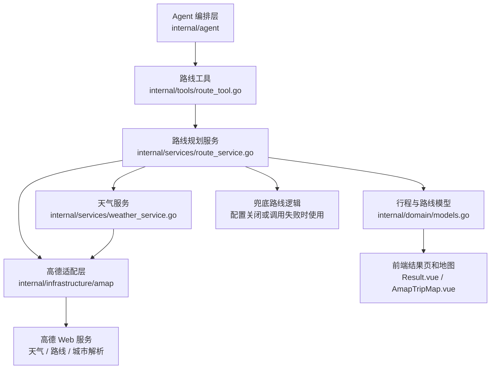

# 路线规划优化记录

本文档记录旅游助手 Agent 中“路线规划”模块的后续优化方向。当前项目已经接入高德真实路线能力，后续重点不是再补一个接口，而是让路线结果更贴近真实出行顺序、天气条件、预算和用户偏好。

## 路线模块框架图



## 当前已完成

后端已经具备以下能力：

- 接入高德 WebService 路线规划 2.0。
- 支持步行和驾车路线规划。
- 根据两点距离和天气风险自动选择步行或驾车。
- 将路线距离、耗时、路线 polyline、费用、路线摘要写回 `transport`。
- 在高德配置未开启或 Key 不存在时保留兜底行为，不阻断行程生成。
- Agent 默认工作流和 tool-calling Agent 都会尝试进行路线补全。
- 前端地图可以使用高德 polyline 绘制真实道路路线。
- 结果页可以展示路线状态、交通方式、距离、耗时、费用和路线摘要。

## 当前主要问题

### 1. 当天路线顺序还不够真实

当前路线节点主要来自当天的景点和餐饮点，但还没有严格按照时间线组织。真实旅游路线应该接近：

```text
酒店/出发点 -> 上午景点 -> 午餐 -> 下午景点 -> 晚餐 -> 酒店/结束点
```

如果仅按数据结构顺序拼接，可能出现“所有景点走完再去吃饭”的不自然路线。

### 2. 天气对路线的影响还比较粗

当前天气只用于判断是否有雨，并在有雨时倾向驾车。后续应该进一步处理：

- 雨天减少长距离步行。
- 高温天气减少中午户外步行。
- 大风天气减少临水、高处、海边长时间路线。
- 低温天气减少夜间长距离步行。

### 3. 缺少路线缓存

每次生成行程都请求高德路线，会带来：

- 接口调用量增加。
- 响应速度变慢。
- 同一条路线重复请求。

后续需要缓存天气、POI 和路线结果。

### 4. 交通方式还不完整

当前主要支持：

- 步行
- 驾车/打车

后续可以逐步扩展：

- 公交/地铁
- 骑行
- 跨城火车
- 飞机
- 大巴

### 5. 路线解释还不够 Agent 化

当前可以展示路线结果，但还缺少“为什么这样安排”的解释。例如：

```text
推荐打车：两点距离 4.8km，步行预计 70 分钟，且当天有小雨。
```

这类解释能让用户理解 Agent 的路线决策。

## 优化优先级

### P0：按时间顺序构建当天路线节点

目标：让路线规划基于真实行程时间线。

建议新增一个 route node 构建函数，例如：

```go
type RouteNode struct {
    Name      string
    Kind      string
    StartTime string
    EndTime   string
    Latitude  float64
    Longitude float64
    POIID     string
}
```

构建规则：

- 景点使用 `start_time` 排序。
- 午餐插入 11:30 到 13:30 附近。
- 晚餐插入 17:30 到 19:30 附近。
- 如果当天有酒店坐标，作为当天开始和结束节点。
- 如果缺少时间，则保留原有顺序作为兜底。

验收标准：

- 每一天的 `transport` 顺序与当天展示时间线一致。
- 午餐不会被排到所有景点之后。
- 酒店坐标存在时，可以生成“酒店 -> 首个点位”和“最后点位 -> 酒店”的路线。

### P1：天气约束参与路线策略

目标：天气不只是展示，而是影响路线选择。

建议规则：

- 有雨、雪、雷暴：超过 800m 优先驾车。
- 高温：12:00 到 15:00 减少步行路线。
- 大风：减少临水或山顶相关点位之间的步行。
- 低温：夜间路线优先打车。

验收标准：

- 雨天路线中长距离步行明显减少。
- 天气建议和交通建议保持一致。
- 前端能看到路线调整原因。

### P1：路线缓存

目标：减少重复请求，提高响应速度。

建议缓存 key：

```text
route:{mode}:{origin_lng},{origin_lat}:{dest_lng},{dest_lat}
weather:{city}:{date}
poi:{destination}:{place_name}
```

早期实现可以使用本地 JSON 或内存 map；后续再迁移到 Redis / SQLite。

验收标准：

- 相同两点、相同 mode 不重复请求高德。
- 缓存命中有日志。
- 高德接口失败时，可以读取旧缓存作为弱兜底。

### P2：支持公交/地铁路线

目标：给预算敏感用户更真实的低成本路线。

建议逻辑：

- 用户预算紧张时优先考虑公交/地铁。
- 城市内长距离且非赶时间时考虑公交。
- 雨天公交和打车都可作为候选，但步行距离过长时降低公交优先级。

验收标准：

- `transport.route_mode` 支持 `transit`。
- 前端能展示公交耗时、距离和费用。
- Agent 能解释选择公交的原因。

### P2：路线解释字段

目标：让用户知道为什么推荐这种交通方式。

建议在 `TransportItem` 中增加：

```go
RouteReason string `json:"route_reason,omitempty"`
```

示例：

```text
两点距离较近且天气良好，推荐步行。
当天有雨且路线超过 1.5km，推荐打车减少户外暴露。
预算较紧且地铁可达，推荐公共交通。
```

验收标准：

- 每段路线有可读解释。
- 解释能体现距离、天气、预算或用户偏好。
- 前端交通卡片能展示解释。

## 推荐开发顺序

1. 先做 P0：按时间顺序构建 route nodes。
2. 再做 P1：天气约束影响 mode 选择。
3. 再做 P1：路线缓存。
4. 再做 P2：公交/地铁。
5. 最后做 P2：路线解释和前端展示增强。

## 相关代码位置

- `backend-go/internal/services/route_service.go`
- `backend-go/internal/services/weather_service.go`
- `backend-go/internal/tools/route_tool.go`
- `backend-go/internal/agent/steps.go`
- `backend-go/internal/agent/tool_calling_agent.go`
- `backend-go/internal/domain/models.go`
- `frontend/src/views/Result.vue`
- `frontend/src/components/AmapTripMap.vue`
- `frontend/src/types/index.ts`

## 下一步建议

下一步建议优先实现：

```text
按时间顺序构建当天路线节点
```

这是路线规划质量的基础。完成后，天气策略、缓存、公交路线和路线解释都会更容易接上。
