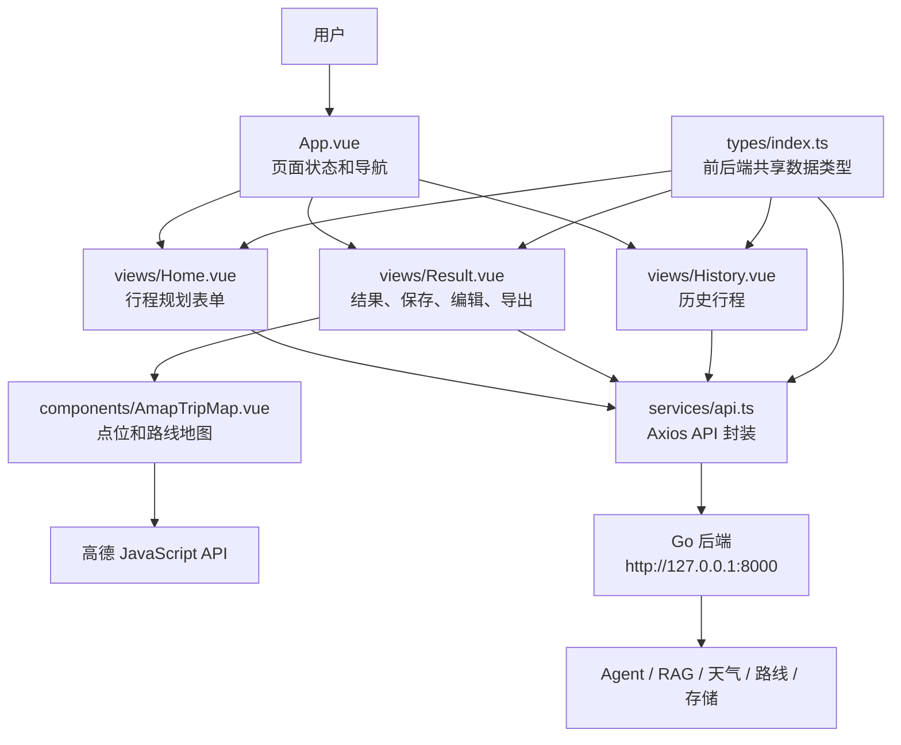

# 前端开发说明

`frontend/` 是旅行助手 Agent 的 Vue 前端，使用 Vue 3、TypeScript、Vite、Ant Design Vue、Axios 和高德 JavaScript API。它负责用户交互、表单填写、行程结果展示、历史记录、地图路线渲染、天气展示、智能调整和 Markdown 导出入口。

前端不直接调用 Qdrant、Ollama 或高德 Web 服务。所有业务能力都通过 Go 后端接口完成；前端只需要知道后端 HTTP 地址和前端地图的高德 JavaScript API Key。

## 前端框架图



## 当前能力

- 规划页：填写目的地、日期、人数、预算、偏好和备注，调用 `/trip/generate`。
- 结果页：展示行程概览、预算明细、按天花费、地图、天气、点位图片、路线信息和每日安排。
- 保存：调用 `/trip/save`。
- 历史列表：调用 `/trip` 和 `/trip/{trip_id}`。
- 删除历史行程：调用 `DELETE /trip/{trip_id}`。
- 智能调整：调用 `/trip/edit`。
- 导出：支持 Markdown，导出前会先保存当前页面数据。
- 地图：通过高德 JavaScript API 展示点位和路线 polyline。
- 天气：展示 Go 后端 `/weather/forecast` 返回的数据。

当前 Go 后端尚未实现 PDF 导出，所以前端不提供 PDF 导出入口。

## 目录结构

```text
frontend/
├── src/
│   ├── App.vue                    # 顶层页面状态和导航
│   ├── main.ts                    # Vue 应用入口
│   ├── assets/styles.css          # 全局样式
│   ├── services/api.ts            # Axios 实例和后端 API 封装
│   ├── types/index.ts             # 行程、天气、路线等 TypeScript 类型
│   ├── components/
│   │   └── AmapTripMap.vue        # 高德地图展示组件
│   └── views/
│       ├── Home.vue               # 规划页
│       ├── Result.vue             # 结果页
│       └── History.vue            # 历史页
├── package.json
├── vite.config.ts
└── README.md
```

## 环境变量

在 `frontend/` 目录下创建 `.env`：

```env
VITE_API_BASE_URL=http://127.0.0.1:8000
VITE_AMAP_JS_KEY=你的高德 JavaScript API key
```

说明：

- `VITE_API_BASE_URL` 必须是浏览器能访问到的 Go 后端地址。
- 高德前端地图需要 JavaScript API key，不是后端 Web 服务 key。
- 修改 `.env` 后需要重启 `npm run dev`。

## 启动方式

先启动 Go 后端：

```powershell
cd F:\Code\Travel-Agent\backend-go
go run ./cmd/server
```

确认后端可访问：

```text
http://127.0.0.1:8000/health
```

再启动前端：

```powershell
cd F:\Code\Travel-Agent\frontend
npm install
npm run dev
```

浏览器访问：

```text
http://127.0.0.1:5173
```

## 构建验证

```powershell
cd F:\Code\Travel-Agent\frontend
npm run build
```

Vite 可能提示主 chunk 大于 500 kB，这是依赖体积警告，不影响运行。

## 开发规则

- 新增后端接口时，先在 `src/services/api.ts` 封装，再给页面使用。
- 新增行程字段时，同步更新 `src/types/index.ts`。
- 地图相关展示逻辑优先放在 `components/AmapTripMap.vue`。
- 页面组件负责交互和展示，不直接拼复杂后端请求。
- 前端不保存模型密钥、高德 Web 服务 Key、Qdrant 地址等后端敏感配置。
